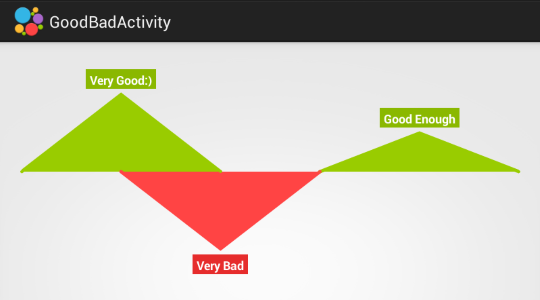

HelloCharts for Android
=======================

Charting library for Android compatible with API 8+(Android 2.2). 
Works best when hardware acceleration is available so I recommend using it with API 14+(Android 4.0).

Supports
--------

 - Line chart
 - Column chart
 - Pie chart
 - Bubble chart
 - Combo chart(columns/lines)
 - Preview charts(for column chart and line chart)
 - Animations
 - Zoom(pinch to zoom, double tap zoom), scroll and fling
 - Value selection
 - Customizable labels for values
 - Custom and auto-generated axes(most charts handles four axes: top, bottom, left, right)
 - Some other attributes like colours, fonts, lines thickness, pints radius etc.

Screens and Samples
-------------------

Usage
-----

Contribution
------------

License
=======

    Copyright 2014 Leszek Wach

    Licensed under the Apache License, Version 2.0 (the "License");
    you may not use this file except in compliance with the License.
    You may obtain a copy of the License at

       http://www.apache.org/licenses/LICENSE-2.0

    Unless required by applicable law or agreed to in writing, software
    distributed under the License is distributed on an "AS IS" BASIS,
    WITHOUT WARRANTIES OR CONDITIONS OF ANY KIND, either express or implied.
    See the License for the specific language governing permissions and
    limitations under the License.
