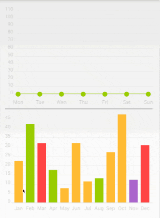
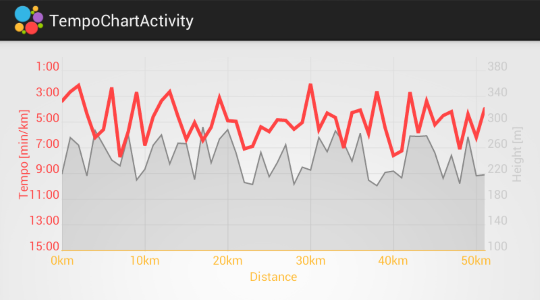
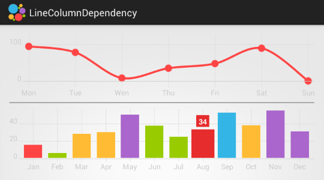
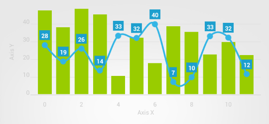
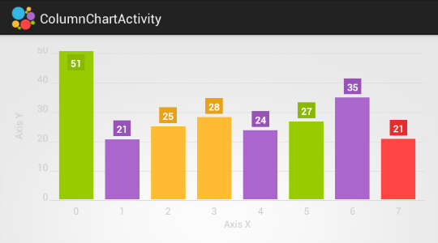
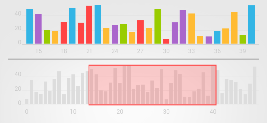
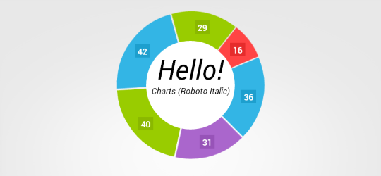
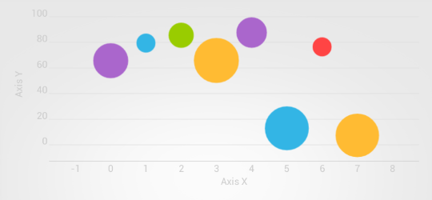

#HelloCharts for Android

Charting library for Android compatible with API 8+(Android 2.2).
Works best when hardware acceleration is available, so API 14+(Android 4.0) is recommended.
Apache License 2.0.

[](https://android-arsenal.com/details/1/1068)

##Features

 - Line chart(cubic lines, filled lines, scattered points)
 - Column chart(grouped, stacked, negative values)
 - Pie chart
 - Bubble chart
 - Combo chart(columns/lines)
 - Preview charts(for column chart and line chart)
 - Zoom(pinch to zoom, double tap zoom), scroll and fling
 - Custom and auto-generated axes(top, bottom, left, right, inside)
 - Animations

##Screens and Demos

 - Code of a demo application is in `hellocharts-samples` directory, requires appcompat v21. 
 - The **demo app** is also ready for download on [**Google Play**](https://play.google.com/store/apps/details?id=lecho.lib.hellocharts.samples).  
 - Short **video** is available on [**YouTube**](https://www.youtube.com/watch?v=xbSBjyjH2SY).

















##Download and Import

###Eclipse/ADT

 - download hellocharts-library-<version>.jar from releases page and copy it into the `libs` folder of your
 application project.

 **or**

 - download/clone repository and import hellocharts-library project into your workspace: `File -> Import -> Android ->
 Existing Android Code` and select hellocharts-library directory. Right click on application project `Properties ->
 Android -> Add` and select hellocharts library project.

###Android Studio/Gradle

 You will need to install Build-tools 21.0.2 and Android Support Repository(from Android SDK Manager).

 - download/clone repository and import hellocharts-library as module: `File -> Import Module` and select
 hellocharts-library directory. Add dependency:
 ```groovy
     compile project(':hellocharts-library')
 ```

 **or**

 - download/clone repository and publish library artifact into your local or remote repository. Go to
 hellocharts-library directory and execute `gradle clean build publishToMavenLocal` to publish to maven local
  repository. Go to hellocharts-library directory and execute `gradle clean build publish` to publish to other
  repository configured in build.gradle(you need to modify repository url and credentials in build.gradle file). Add
  dependency:
 ```groovy
     compile 'lecho.lib.hellocharts:hellocharts-library:1.1@aar'
     compile 'com.android.support:support-v4:21.0.+'
 ```

##Usage

Every chart view can be defined in layout xml file:

 ```xml
    <lecho.lib.hellocharts.view.LineChartView
        android:id="@+id/chart"
        android:layout_width="match_parent"
        android:layout_height="match_parent" />
 ```

 or created in code and added to layout later:

 ```java
    LineChartView chart = new LineChartView(context);
    layout.addView(chart);
 ```

 Use methods from *Chart classes to define chart behaviour, example methods:

 ```java
    Chart.setInteractive(boolean isInteractive);
    Chart.setZoomType(ZoomType zoomType);
    Chart.setContainerScrollEnabled(boolean isEnabled, ContainerScrollType type);
 ```

 Use methods from data models to define how chart looks like, example methods:

 ```java
    ChartData.setAxisXBottom(Axis axisX);
    ColumnChartData.setStacked(boolean isStacked);
    Line.setStrokeWidth(int strokeWidthDp);
 ```

 Every chart has its own method to set chart data and its own data model, example for line chart:

 ```java
    List<PointValue> values = new ArrayList<PointValue>();
    values.add(new PointValue(0, 2));
    values.add(new PointValue(1, 4));
    values.add(new PointValue(2, 3));
    values.add(new PointValue(3, 4));

    //In most cased you can call data model methods in builder-pattern-like manner.
    Line line = new Line(values).setColor(Color.Blue).setCubic(true);
    List<Line> lines = new ArrayList<Line>();
    lines.add(line);

    LineChartData data = new LineChartData();
    data.setLines(lines);

	LineChartView chart = new LineChartView(context);
    chart.setLineChartData(data);
 ```

 After the chart data has been set you can still modify its attributes but right after that you should call
 `set*ChartData()` method again to let chart recalculate and redraw data. There is also an option to use copy constructor for deep copy of
 chart data. You can safely modify copy in other threads and pass it to `set*ChartData()` method later.


##Contributing

Yes:) If you found a bug, have an idea how to improve library or have a question, please create new issue or comment existing one. If you would like to contribute code fork the repository and send a pull request.

#License

	HelloCharts	
    Copyright 2014 Leszek Wach

    Licensed under the Apache License, Version 2.0 (the "License");
    you may not use this file except in compliance with the License.
    You may obtain a copy of the License at

       http://www.apache.org/licenses/LICENSE-2.0

    Unless required by applicable law or agreed to in writing, software
    distributed under the License is distributed on an "AS IS" BASIS,
    WITHOUT WARRANTIES OR CONDITIONS OF ANY KIND, either express or implied.
    See the License for the specific language governing permissions and
    limitations under the License.

---
     HelloCharts library uses code from InteractiveChart sample available 
     on Android Developers page:
	 
       http://developer.android.com/training/gestures/scale.html
